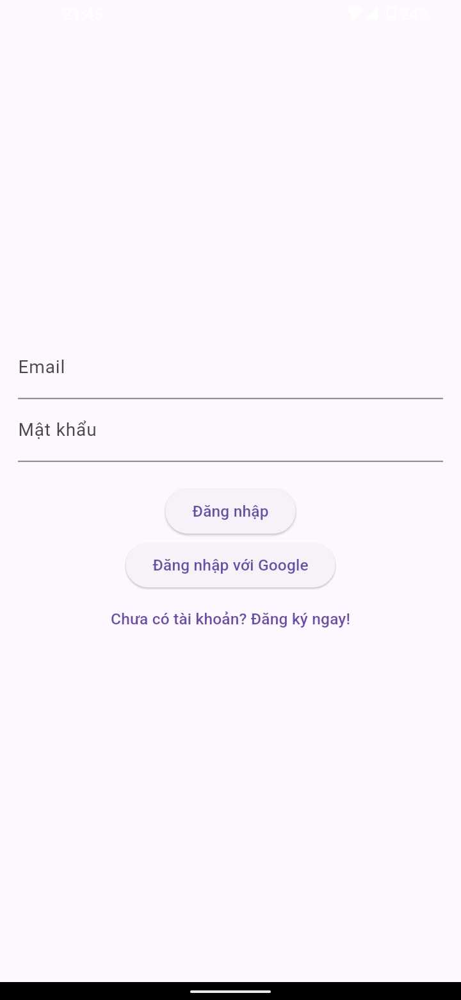
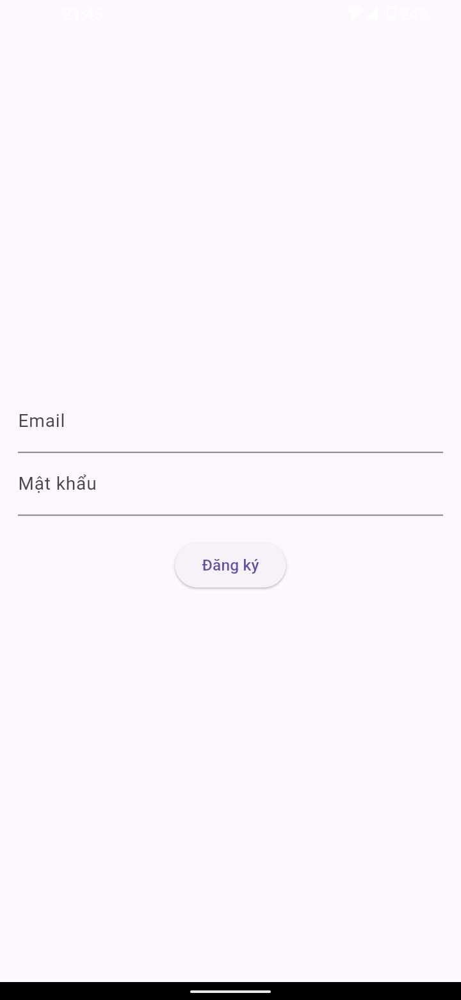
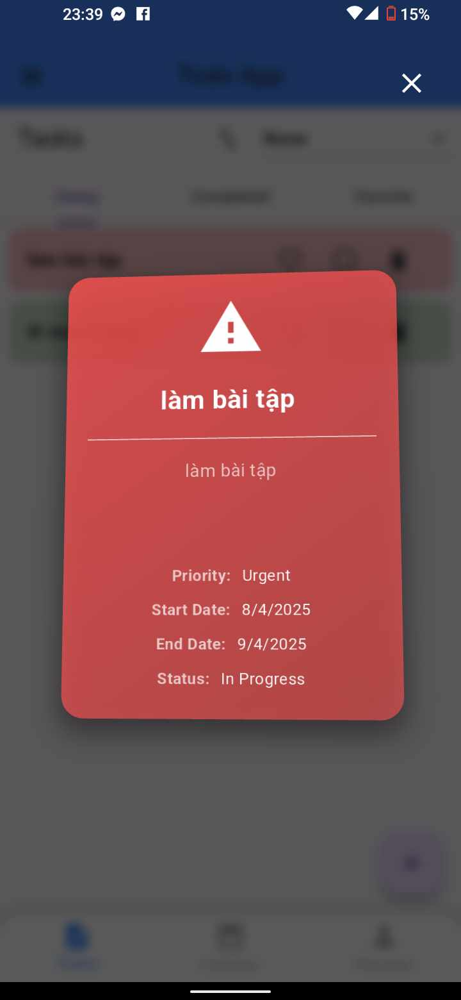
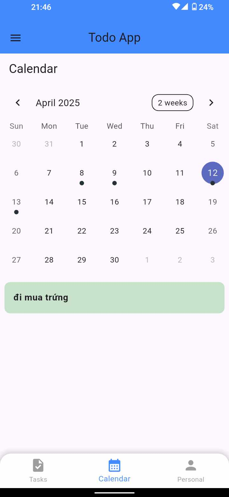
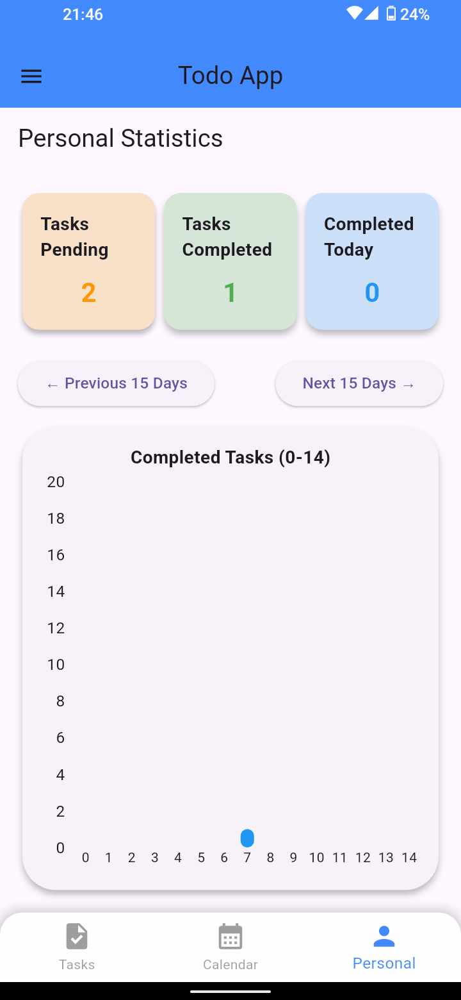
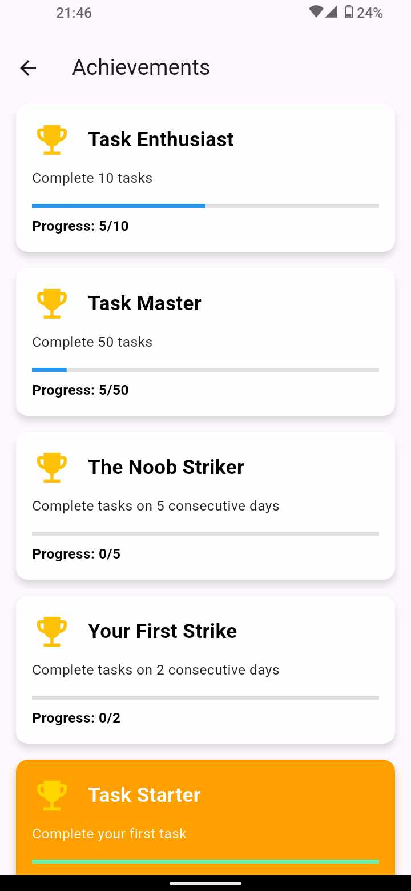
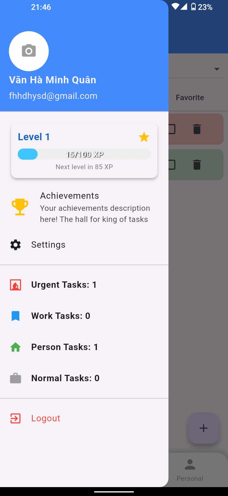
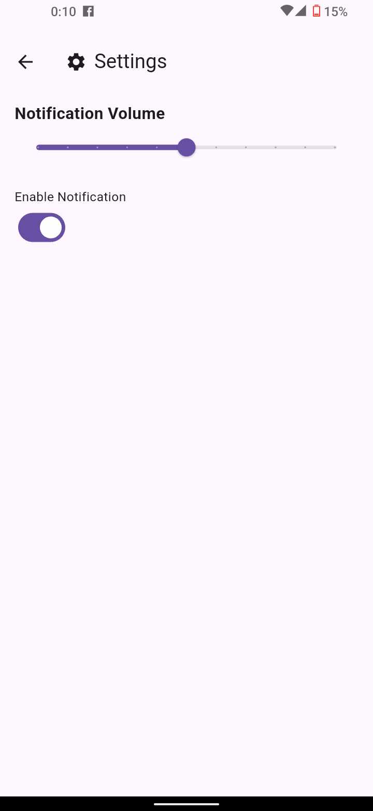
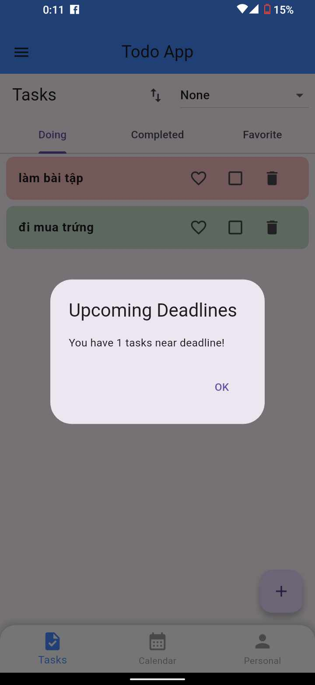

# 📅 3D TodoList App

A powerful and intuitive **Task Management App** with a unique **3D task viewer**, calendar-based task browsing, full task statistics and visual analytics. Built for productivity lovers and goal-driven users!

---

## 🚀 Features

### ✅ Task Management
- Create, edit, delete tasks easily
- Assign **priority levels**, **tags**, and **categories**
- Sort tasks:
  - Alphabetically (A-Z, Z-A)
  - By **Priority**
  - By **Experience System** (XP)
  - By **Achievements**

### 🔐 Authentication
- **Sign Up** with email and password
- **Secure Sign In** with Firebase Authentication
- Persistent login session
- Support for password reset and email verification *(optional)*




### 🧭 3D Task Visualization
- Explore your task details in a **3D interactive interface**
- Zoom, rotate, and pan to view your task attributes in a fun and immersive way!



### 📆 Integrated Calendar View
- View all your tasks on a **monthly calendar**
- Click on any date to see tasks scheduled for that day
- Identify deadlines at a glance



### 📊 Task Statistics and Insights
- Visual graphs showing:
  - Completed tasks per day/week/month
  - Task completion trends over time
  - Daily productivity summaries
- Track:
  - 📈 All completed tasks since beginning
  - 📅 Tasks completed today



### 🏆 Achievements & Experience System
- Earn XP by completing tasks
- Unlock badges and achievements
- Level up as you progress!




---

### Sound Announcement
- You can turn on or turn It off.
- Change the volume of the announce.
- It will only announce numbere of Task that has currentDate - EndDate <= 3




## 📦 Installation

```bash
git clone https://github.com/yourusername/3d-todolist.git
cd 3d-todolist
flutter pub get
flutter run
